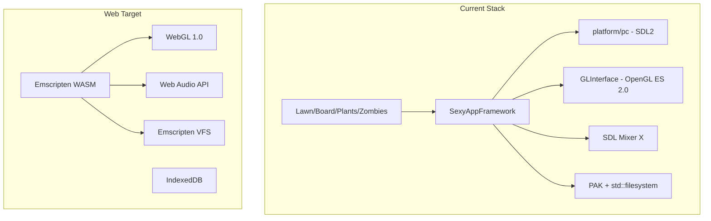

# PVZ_ONO Web Version: Main Challenges and Steps

Your project is a **C++20** reimplementation of Plants vs Zombies using **SDL2**, **OpenGL ES 2.0**, **SDL Mixer X**, and a custom **PAK** asset loader. The architecture is already modular (platform `pc/`, `switch/`, `3ds/`), which helps porting. Below are the main challenges and what to do for each.

---

## Architecture Overview

---

## Main Challenges (Ranked by Difficulty)

### 1. Audio: SDL Mixer X (High) — **CHOSEN: Option B**

**Problem:** SDL Mixer X is a large C library (OGG, MP3, WAV, MO3 via libopenmpt, mpg123, vorbis). Emscripten has no official SDL_mixer port, and each codec has its own native dependencies.

**Chosen approach:** Add a thin web-only audio backend that uses the **Web Audio API** instead of SDL Mixer X. Map `PlayMusic`, `PlaySound` calls to JS via `EM_JS` or a small JS shim. This isolates web-specific work and avoids building libopenmpt/mpg123 for Emscripten.

**Implementation:** Create `WebAudioSoundManager` and `WebMusicInterface` in `src/SexyAppFramework/sound/`, conditionally compiled for `__EMSCRIPTEN`__, wiring through `SexyAppBase::CreateMusicInterface()` and `Init()`.

---

### 2. Asset Loading: PAK and Filesystem (Medium–High)

**Problem:** Assets come from:

- `main.pak` (PopCap PAK, XOR 0xF7) loaded at startup via [PakInterface.cpp](src/SexyAppFramework/paklib/PakInterface.cpp)
- `p_fopen` used throughout (ImageLib, SDLSoundManager, Music, Definition, XMLParser, etc.)
- [Common.cpp](src/SexyAppFramework/Common.cpp) uses `std::filesystem` for paths, exists, create_directories

**What to do:**

- Use **Emscripten preloaded FS**: embed or fetch `main.pak` and `properties/` at load time and place them in the virtual filesystem. The existing PAK loader can then use normal file I/O.
- Emscripten’s FS API emulates `fopen`/`fread`; PAK reads from `mDataPtr` (malloc’d) after loading, so you mainly need to load the PAK bytes into memory and feed them to the existing loader (e.g., via `--preload-file main.pak` or `fetch` + FS API).
- For `std::filesystem`, Emscripten has `-sUSE_FILESYSTEM=1` and provides emulation. Path operations in Common.cpp should work if the virtual FS is populated correctly.

---

### 3. Platform Layer: Window and Input (Medium)

**Problem:** [platform/pc/Window.cpp](src/SexyAppFramework/platform/pc/Window.cpp) uses SDL2 to create a window and OpenGL context. On the web there is no real window; the canvas is the display surface.

**What to do:**

- Add `platform/emscripten/` with `Window.cpp` and `Input.cpp` (similar to `pc/`, `switch/`, `3ds/`).
- Use SDL2 in Emscripten mode (`USE_SDL=2`), which creates a canvas and maps to WebGL. SDL_CreateWindow and SDL_GL_CreateContext are supported.
- Touch and mouse input are handled by Emscripten’s SDL2 port. Minimal changes if your input layer is already SDL-based.

---

### 4. Threading: Loading Thread (Medium) — **CHOSEN: Option B**

**Problem:** [SexyAppBase.cpp](src/SexyAppFramework/SexyAppBase.cpp) uses `std::thread(LoadingThreadProcStub, this).detach()` for resource loading.

**Chosen approach:** Add `#ifdef __EMSCRIPTEN`__ and run loading on the main thread. Initial load may block briefly; often acceptable for a single load screen. Avoids pthreads, SharedArrayBuffer, and COOP/COEP headers.

---

### 5. Persistence: Saves and User Data (Medium)

**Problem:** Writable data (userdata, cache, registry) goes to `SDL_GetPrefPath` or custom paths. The web has no real filesystem.

**What to do:**

- Use Emscripten’s `-sEXIT_RUNTIME=0` and its virtual FS with persistence (`IDBFS`).
- Map the app data path to an IDBFS mount so `std::filesystem` and file writes go to IndexedDB. Requires explicit sync calls (`FS.syncfs`) after writes.

---

### 6. Graphics: OpenGL ES 2.0 (Low)

**Problem:** Need a WebGL backend.

**What to do:** OpenGL ES 2.0 is very close to WebGL 1.0. Emscripten’s GL layer maps it. Your [GLInterface](src/SexyAppFramework/graphics/) uses standard GL calls; they should work with minor or no changes. The software fallback (SWTri) can be disabled for web.

---

### 7. Dependencies and Build (Medium)

**Problem:** vcpkg packages (vorbis, libopenmpt, mpg123, libpng, libjpeg, zlib) must be built for Emscripten.

**What to do:**

- Use `vcpkg install ... --triplet wasm32-emscripten` if ports exist.
- Alternatively, Emscripten provides many libs; prefer Emscripten ports over vcpkg where possible.
- For Option B (Web Audio backend), you may avoid building libopenmpt/mpg123 for web entirely.

---

## What You Need to Do (High-Level Steps)

| Step | Task                                                                                    | Effort   |
| ---- | --------------------------------------------------------------------------------------- | -------- |
| 1    | Add Emscripten toolchain file and `EMSCRIPTEN` branch in CMake (like `NINTENDO_SWITCH`) | 1–2 days |
| 2    | Create `platform/emscripten/Window.cpp` and `Input.cpp` (SDL2 in Emscripten mode)       | 1–2 days |
| 3    | Handle assets: preload `main.pak` and `properties/` into Emscripten FS                  | 1–2 days |
| 4    | Resolve threading: `#ifdef __EMSCRIPTEN`__ main-thread loading (chosen)                 | 0.5 day  |
| 5    | Implement web audio: Web Audio backend (WebAudioSoundManager + WebMusicInterface)       | 3–7 days |
| 6    | Add IDBFS for saves/userdata and ensure `FS.syncfs` on save                             | 1–2 days |
| 7    | Create HTML shell and serve script; test in browser                                     | 1–2 days |
| 8    | Tune performance and memory; possibly add low-memory mode                               | 1–3 days |

**Total rough estimate:** 2–4 weeks for an MVP, 1–2 months for full parity (audio, saves, mobile).

---

## Recommended Approach

1. Start with **Emscripten + SDL2 + WebGL** — your graphics stack fits WebGL 1.0 well.
2. Use **preloaded FS** for `main.pak` and `properties/` — keep the existing PAK logic.
3. Add a **Web Audio backend** instead of porting SDL Mixer X — faster and fewer dependencies.
4. Run **loading on the main thread** on web to avoid pthread/SharedArrayBuffer restrictions initially.
5. Add **IDBFS** for user data so saves and settings persist across sessions.

---

## Important Files to Modify or Add

- [CMakeLists.txt](CMakeLists.txt) — add `EMSCRIPTEN` platform branch and Emscripten-specific link flags
- **New:** `src/SexyAppFramework/platform/emscripten/Window.cpp`
- **New:** `src/SexyAppFramework/platform/emscripten/Input.cpp`
- **New:** `src/SexyAppFramework/sound/WebAudioSoundManager.cpp` (if using Web Audio shim)
- [SexyAppBase.cpp](src/SexyAppFramework/SexyAppBase.cpp) — conditional loading-thread behavior
- [Common.cpp](src/SexyAppFramework/Common.cpp) — path / FS handling for Emscripten
- **New:** `index.html` + `shell.html` for Emscripten

---

## Legal Note (from README)

You must provide your own `main.pak` and `properties/` from a legally purchased copy of PvZ GOTY. The web build will need a way to load these (e.g., user upload or hosting your own purchased copy for personal use, per license terms).